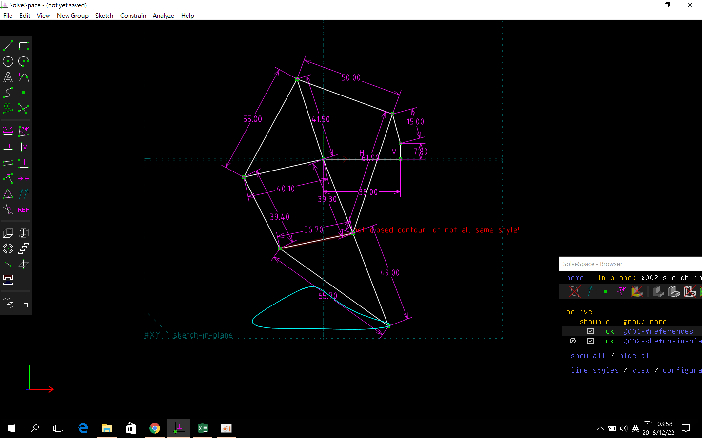
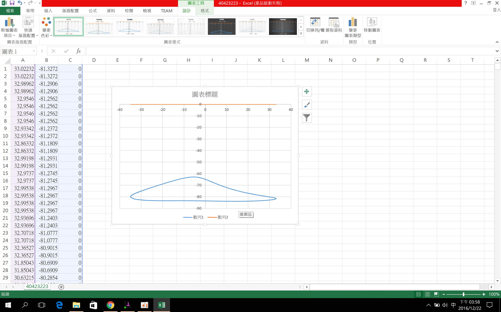

Title: Linkages (四連桿與多連桿運動模擬) w15:
Date: 2016-12-30 12:00
Category: Misc
Tags: 上課內容, OnShape, SolveSpace
Author: 40423223
 
 
Linkages (四連桿與多連桿運動模擬):

 
<iframe width="560" height="315" src="https://www.youtube.com/embed/oxu-mzaZjss" frameborder="0" allowfullscreen></iframe>

將所得到的點座標 .csv 以 Excel 畫圖, 得到:
  

